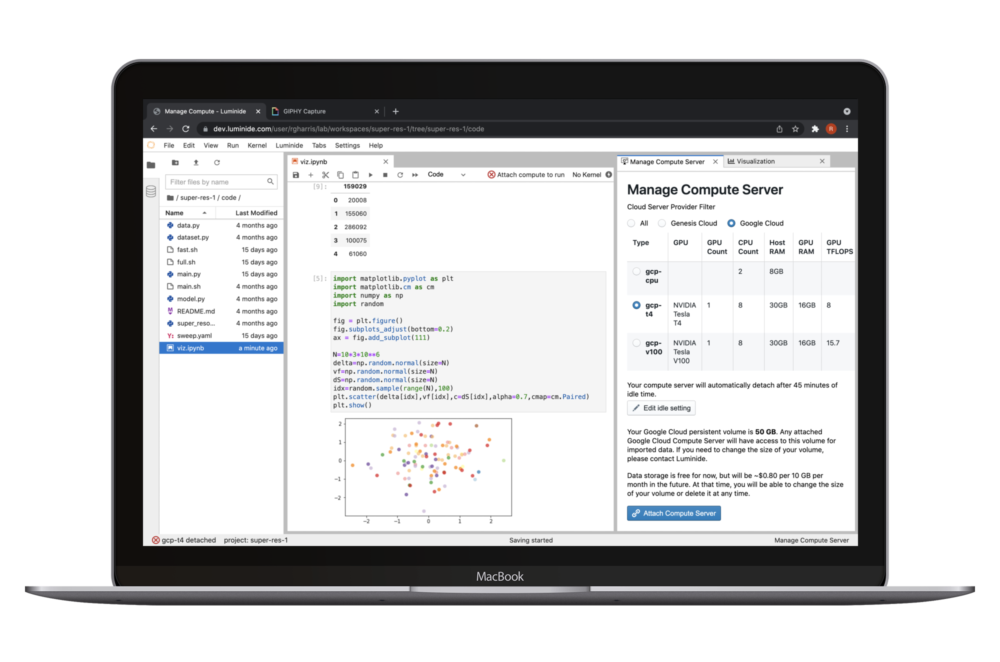

Luminide Documentation
==================================================

Luminide makes it easier to build better AI models.  To get started, we recommend reading the short :ref:`Overview<starting-overview>` and then doing the :ref:`Tutorial<plant-leaf-tutorial>`.

.. toctree::
   :caption: Getting Started
   :hidden:

   tutorial/overview
   Tutorial <tutorial/plant.md>
   community/discussions.md

.. toctree::
   :caption: Documentation
   :hidden:

   docs/compute.md
   docs/code
   docs/data
   docs/run-experiment
   docs/tracking-visualization
   docs/hyperparameter-tuning
   docs/early-ranking
   docs/projects-packages
   docs/terminals
   docs/python-pytorch
   docs/configuration

.. toctree::
   :caption: FAQ
   :hidden:

   Frequently Asked Questions <faq/faq>
